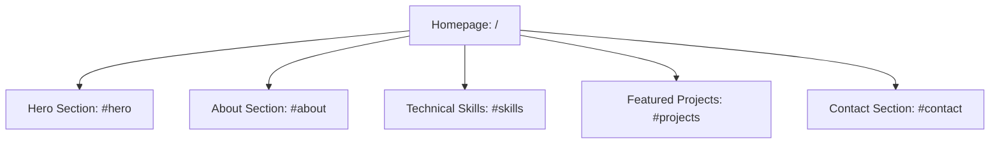
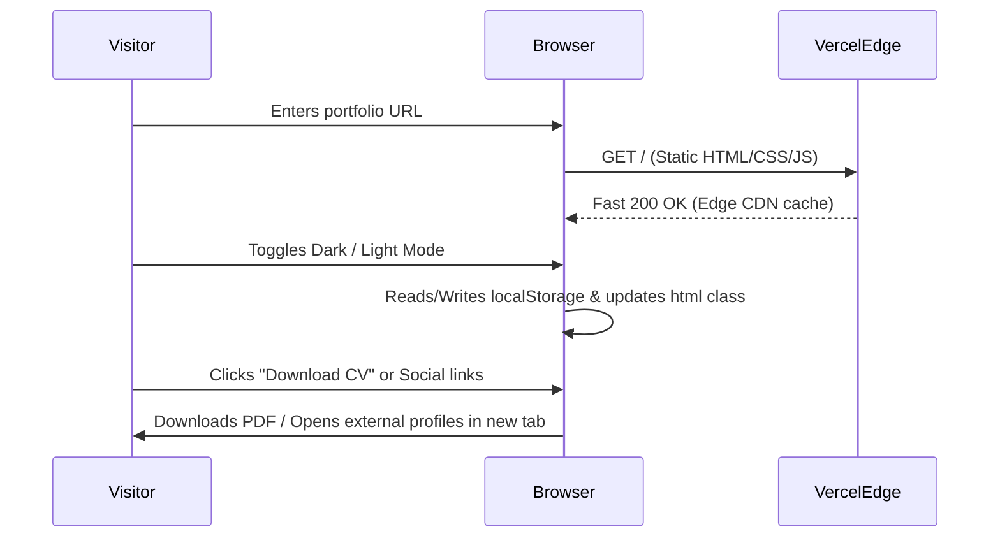

# Pre-Production Plan — Rifki Fauzi Portfolio (Next.js Static Export)

## 1. Discovery & Requirements
**Problem:** The existing CodeIgniter 4 application requires PHP, Apache/Docker runtime, and a live MySQL database, creating deployment fragility and container crashes on serverless platforms like Vercel.
**Target users:** Recruiters, potential employers, collaborators, and clients seeking information about Rifki Fauzi's profile, technical skill set, and projects.
**Scope (MVP vs beyond):**
- **MVP:** Full migration of the public portfolio into a modern, lightning-fast static website using Next.js (App Router) with static export (`output: 'export'`), responsive layouts, dark/light theme switching, and deployment on Vercel.
- **Excluded from MVP:** Database storage, admin authentication, dynamic admin CMS, and backend server runtime.
**Success metrics:**
- 100% static HTML/CSS/JS generation with zero backend dependencies.
- Perfect zero-configuration deployment on Vercel.
- Sub-second first-contentful-paint (FCP) and high Core Web Vitals score.
- WCAG AA accessibility compliance across both light and dark modes.
**Constraints:**
- No emoji usage in visual UI or copy; strictly use Remix Icon icons.
- Must preserve all existing portfolio copy, assets (CV PDF, project screenshots, profile picture), and links.
- Single codebase replacement at the root repository.

## 2. Content & Assets
**Copy status:** Final (extracted directly from existing CodeIgniter views and database seeds).
**Visual assets needed:**
- Profile picture: `public/images/profile/profile.png` -> `/profile.png`
- CV file: `public/uploads/cv/CV-Rifki-Fauzi.pdf` -> `/cv/CV-Rifki-Fauzi.pdf`
- Project imagery: `public/images/projects/project-web-flnx.png` and uploaded previews -> `/projects/*`
- Favicon: existing `public/favicon.ico` -> `app/favicon.ico`
**Third-party content:** None. All data is self-contained.

## 3. Information Architecture

**Sitemap / Routes:**


**Critical User Flows:**


**Wireframes:** Preserves existing section hierarchy: Sticky Navbar -> Hero with Profile Image & CTAs -> About Cards (Profile, Education, Areas of Focus, Work Experience) -> Technical Skills Grid with Roles -> Featured Projects Grid -> Contact Cards -> Footer.

## 4. Design
**UI design:** Clean, modern developer portfolio based on existing tailored blue palette and dark-mode tokens.
**Design system:**
- Primary: `#2563eb` (Blue 600)
- Primary Hover: `#1d4ed8` (Blue 700)
- Primary Light: `#dbeafe` (Blue 100)
- Background Light: `#f8fafc` (Slate 50)
- Surface Light: `#ffffff`
- Surface Muted Light: `#f1f5f9` (Slate 100)
- Text Light Mode: `#0f172a` (Slate 900)
- Text Muted Light: `#64748b` (Slate 500)
- Background Dark: `#090d16`
- Surface Dark: `#0f172a`
- Surface Muted Dark: `#1e293b`
- Text Dark Mode: `#f8fafc`
- Text Muted Dark: `#94a3b8`
- Border Light: `#e2e8f0`
- Border Dark: `#334155`
- Font: Inter / Poppins via `next/font/google`
**Responsive:** Breakpoints aligned with Tailwind: Mobile (<768px), Tablet (768px-1024px), Desktop (>1024px).
**Icons library:** Remix Icon React via `@remixicon/react` (verified icon set includes `RiUser3Line`, `RiGraduationCapLine`, `RiComputerLine`, `RiBriefcaseLine`, `RiGithubLine`, `RiInstagramLine`, `RiMailLine`, `RiMoonLine`, `RiSunLine`, `RiDownloadLine`, `RiArrowRightUpLine`, `RiCodeLine`, `RiDatabase2Line`, `RiStackLine`, and `RiCloudLine`).
**Animation lib:** Tailwind CSS transitions and lightweight CSS keyframes for typing effect (zero heavy runtime animation dependencies).
**Animated icons:** Lordicon (no).

## 5. Tech Stack
**Frontend:** Next.js 14+ (App Router, React 19 / 18, TypeScript)
**Output Mode:** Static HTML Export (`output: 'export'` in `next.config.js`)
**Styling:** Tailwind CSS v4 / v3 with CSS variables
**Icons:** `@remixicon/react`
**Backend:** None (Static site)
**Database:** None (Data embedded as TypeScript data structures)
**Auth:** None
**Hosting:** Vercel (zero-config static deployment)
**SEO:** Semantic HTML5, OpenGraph tags, dynamic title/description metadata via Next.js Metadata API.

## 6. Data & Backend
**Data model:** Self-contained TypeScript definitions (`data/portfolio.ts`):
- `profile`: Name, roles, bio, social links, CV path.
- `about`: Profile details, education items, focus areas, work experience timeline.
- `skills`: Array of items with name, role, function, and Lucide icon identifier.
- `projects`: Array of items with title, description, image, optional GitHub URL, and optional demo URL.
- `contacts`: Channels, handles, direct URLs.
**File storage:** Static files hosted directly in `public/` directory (CDN delivered by Vercel).
**Third-party APIs:** None.
**Migration strategy:** Clean extraction of PHP view templates into modern, typed React components.

## 7. Security & Compliance (planned)
**Authn/z model:** None (No private areas or user accounts).
**Input validation:** Client-side only for any interactive forms (Contact opens direct `mailto:` link, eliminating server attack vectors).
**Rate limiting / CORS / CSP:** Standard secure headers via Vercel configuration (`vercel.json` or static headers).
**Injection / XSS / CSRF:** Completely mitigated by React JSX auto-escaping and static compilation with zero dynamic server execution.
**Secrets management:** No secrets required.
**Privacy policy / ToS / Cookies:** No cookies or tracker scripts utilized; GDPR/CCPA compliant by default.

## 8. Environment & Tooling
**Project structure:**
```text
├── app/
│   ├── layout.tsx
│   ├── page.tsx
│   ├── globals.css
│   └── favicon.ico
├── components/
│   ├── Navbar.tsx
│   ├── Hero.tsx
│   ├── About.tsx
│   ├── Skills.tsx
│   ├── Projects.tsx
│   ├── Contact.tsx
│   ├── Footer.tsx
│   └── ThemeToggle.tsx
├── data/
│   └── portfolio.ts
├── public/
│   ├── profile.png
│   ├── cv/
│   └── projects/
├── package.json
├── tsconfig.json
├── next.config.mjs
└── tailwind.config.ts / postcss.config.mjs
```
**CI:** Vercel automatic Git integration (runs `next build` on push to `main`).
**Environment files:** No `.env` needed for production build.
**Conventions:** TypeScript strict mode, ESLint, Prettier, Conventional Commits without co-author tags.
